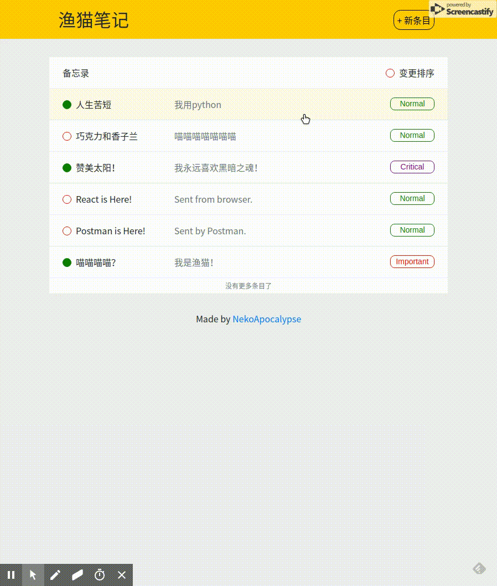

# 渔猫笔记

使用 Django, Django REST, REACT 框架的记事本应用。

## Features

### 备忘录

* 增加/删除/修改/查看 备忘录条目
* 设置完成/未完成标签与优先级标签
* 按照创建顺序或未完成/完成顺序显示条目

### 其他特性

* 移动端优先的响应式设计，使用 Bootstrap 实现
* 配套了 React Router 和 Redux 进行前端跳转和数据存储（实际上没有用到...）

## Setup

* Clone this repository
* Create & activate virtualenv on project root *(use python 3)*
* Install python dependencies: `pip install -r requirements.txt`
* Install npm dependencies: `cd catfish-frontend` and run `npm install`
* Make initial migrations: in `catfish` folder, run `python manage.py migrate`
* Start backend development server: in `catfish` folder, run `python manage.py runserver`
* Start frontent development server: in `catfish-frontend` run `npm run start`

### Pending Features

* 添加设置截止日期功能
* 添加按照优先级/ 截止日期排序功能
* 添加用户登陆和授权功能
* 部署至 AWS 服务器
* 设置 Paginate 功能
* 删除条目时弹出 Modal 确认

### Known Problems & Pending Fix

* Separate compiled css files from source code

### Demo

